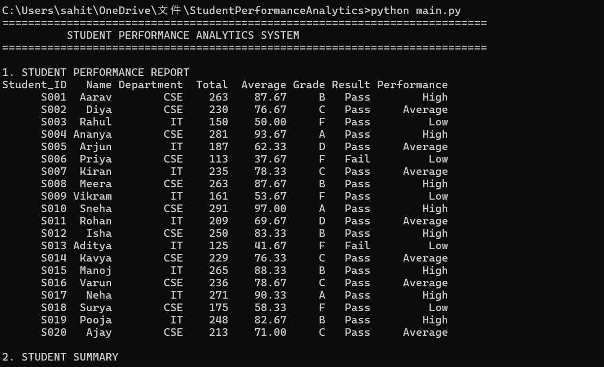
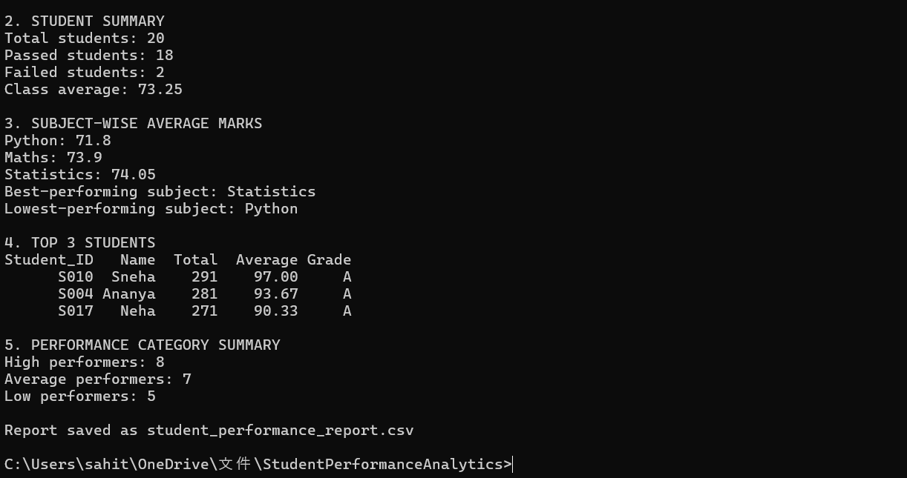

# Student Performance Analytics System

## 1. Project Overview

The **Student Performance Analytics System** is a Python-based project that analyzes student marks and generates a performance report. It uses Python, NumPy, and Pandas to calculate totals, averages, grades, pass/fail results, and subject-wise performance.

## 2. Objective

The main objective of this project is to analyze student academic performance using Python programming and data analysis libraries. It helps identify top-performing students, compare subject averages, and summarize overall class performance.

## 3. Technologies Used

* **Python** – Programming logic, functions, and loops
* **Pandas** – Reading and analyzing student data
* **NumPy** – Numerical calculations
* **CSV** – Storing the student dataset
* **Git and GitHub** – Version control and project hosting
* **Visual Studio Code** – Code development and execution

## 4. Dataset Description

The project uses `students.csv`, containing 20 student records.

The dataset includes the following columns:

* Student_ID
* Name
* Department
* Python
* Maths
* Statistics
* Attendance

Each student has marks for three subjects and an attendance value.

## 5. Key Features

* Reads student data from a CSV file using Pandas.
* Calculates total and average marks.
* Assigns grades based on average marks.
* Identifies students as Pass or Fail.
* Categorizes students into High, Average, and Low performance groups.
* Calculates subject-wise average marks.
* Identifies the best-performing and lowest-performing subjects.
* Displays the top three students based on total marks.
* Summarizes the number of students in each performance category.
* Saves the analyzed results to `student_performance_report.csv`.

## 6. Grading and Result Rules

### Grade Rules

| Average Marks | Grade |
| ------------- | ----- |
| 90 and above  | A     |
| 80–89.99      | B     |
| 70–79.99      | C     |
| 60–69.99      | D     |
| Below 60      | F     |

### Pass/Fail Rules

A student passes if they score at least 40 marks in **each subject**. Otherwise, the student fails.

### Performance Categories

* **High:** Average of 80 or above
* **Average:** Average of 60 to below 80
* **Low:** Average below 60

## 7. How to Run the Project

### Prerequisites

Install Python and the required libraries.

```bash
python -m pip install numpy pandas
```

### Run the Program

Keep `main.py` and `students.csv` in the same project folder. Open the folder in VS Code, open the terminal, and run:

```bash
python main.py
```

The program displays the analysis in the terminal and generates `student_performance_report.csv`.

## 8. Observed Results

The program successfully analyzed 20 students.

* **Total students:** 20
* **Passed students:** 18
* **Failed students:** 2
* **Class average:** 73.25
* **Best-performing subject:** Statistics
* **Lowest-performing subject:** Python
* **High performers:** 8
* **Average performers:** 7
* **Low performers:** 5

The top three students are identified by their total marks in the generated report.

## 9. Screenshots

### Student Performance Report

Shows student totals, averages, grades, pass/fail results, and performance categories.



### Analytics Summary

Shows the class average, subject-wise averages, top three students, and performance category counts.



## 10. Project Files

* `main.py` – Main Python program
* `students.csv` – Input dataset
* `student_performance_report.csv` – Generated analysis report
* `PROJECT_DOCUMENTATION.md` – Detailed project documentation
* `output_screenshot_1.png` – Student report screenshot
* `output_screenshot_2.png` – Analytics screenshot

## 11. Learning Outcomes

Through this project, I practiced Python functions, conditional statements, loops, NumPy calculations, Pandas DataFrame operations, CSV file handling, and GitHub version control.

## 12. GitHub Repository

Repository: https://github.com/Sahithi2201/student-performance-analytics

## 13. Conclusion

The Student Performance Analytics System demonstrates how Python, NumPy, and Pandas can be used to analyze student marks and summarize academic performance. It produces a structured report that helps identify student results, compare subjects, and understand overall class performance.
